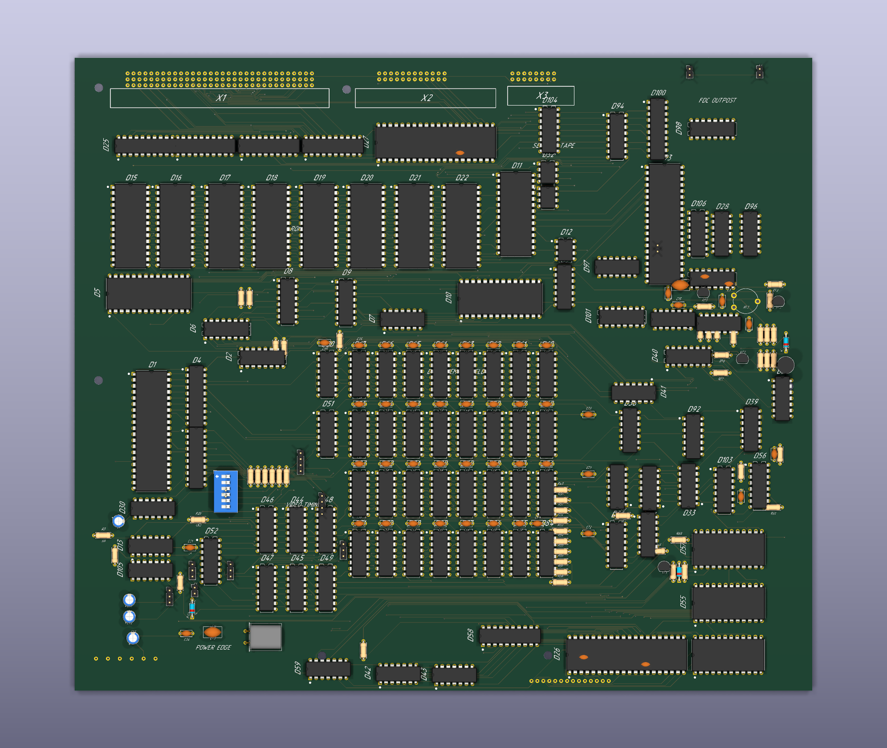
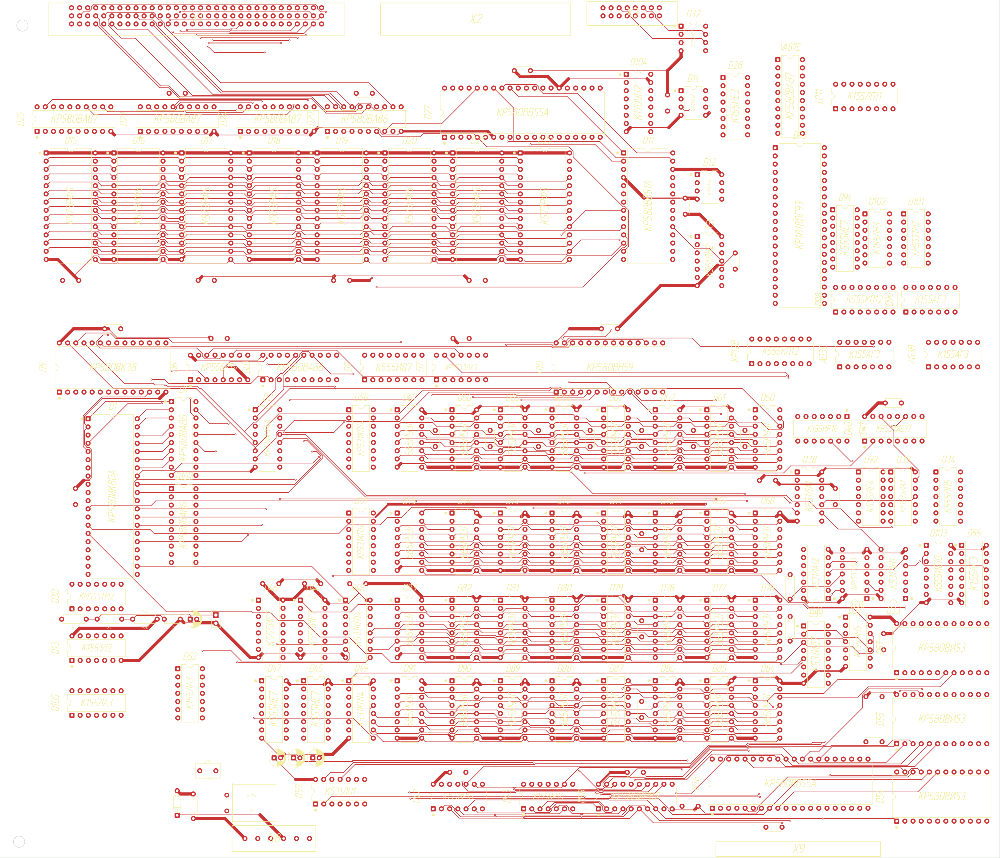
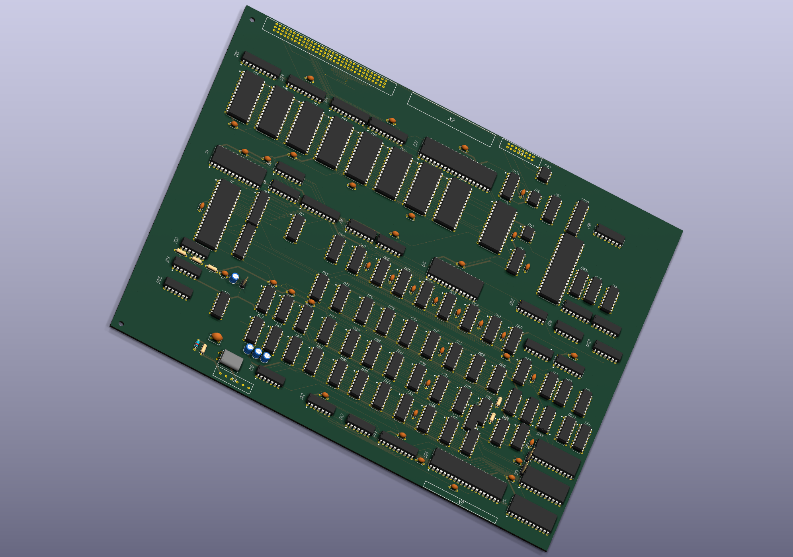
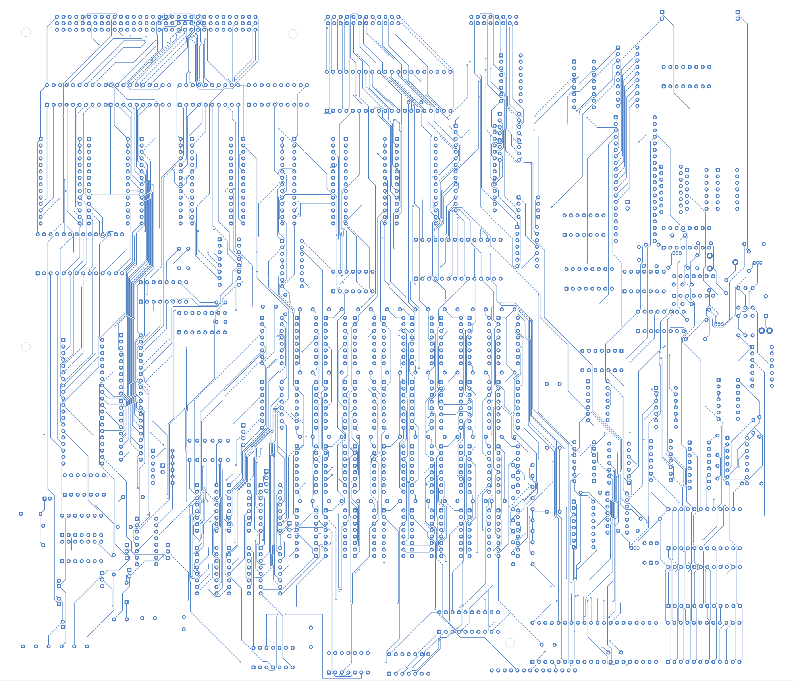

# 8080-cosim

Reconstruction of the Soviet/Estonian Juku E5104 processor board as both a
physical PCB and a runnable, headless digital model. The project’s distinctive
piece is an LVS-style check that compares the structural Verilog connectivity
with the machine-readable board model.

## Current result

- The C emulator and the structural `juku_top` model boot the real Juku ROM,
  render the same framebuffer, accept keyboard input, boot EKDOS from the
  vendored disk images, and reach disk BASIC `READY`. The deep value-level
  guard `sync/cosim_check.sh` compares `juku_top`'s memory reads byte-for-byte
  against the C emulator (`cosim`); the default 130,000-read trace now reaches
  `CTRACE-END` with no address or data divergence, including the BIOS RAM test.
- `sync/check.sh` currently compares 102 mapped instances and 270 nets with no
  KiCad/HDL mismatch.
- The routed main-board artifact has 240 footprints and zero KiCad copper
  clearance, crossing, short, or unconnected findings. The real
  `M5V_DERIVED` rail is routed independently of the rejected D105.10 branch,
  and the merged MEMR islands use a two-via back-layer bridge instead of
  crossing the front-layer select bus. Its saved Gerber/drill ZIP is
  checksum-reproducible, but remains a stale engineering snapshot and is not
  released for manufacture. Current ZIP SHA256:
  `7df2a6e2927c62313275f3f5713e2b4cf3622c3c782b795cf41b27c8f3bfff46`.
  A source-complete replacement candidate is preserved separately with exact
  2,383-pad/net parity, zero unconnected items, and zero electrical DRC findings
  ([docs/routed-refresh-audit.md](docs/routed-refresh-audit.md)). Its zero-open
  state currently copper-substitutes ten documented factory insulated links;
  all twenty paired A-point landings remain absent from the PCB. All ten pairs
  (`А:7`–`А:14`, `А:19`, and `А:20`) are
  registered in drawing-image space. The D38-side `А:8`/`А:9` and D3-side
  `А:20` surface joints are also board-fitted and island-assigned; the other
  seventeen terminals remain unset. The landing
  geometry is an adoption hold
  ([docs/factory-wire-route-fidelity.md](docs/factory-wire-route-fidelity.md)).
- The main board is **not released for fabrication**. Validated physical D2
  `.037`, D6 `.038`, D8 `.039`, and D94 `.092` tables are preserved from
  repeated reads (with D8/D94 provenance aliases counted only once); the measured D2/D30/D105 and
  D6/D13 continuity is adopted in the source model and HDL, while the routed
  snapshot still needs replacement. D94 content truth is closed, but its A0-A4
  input sources, pin 15 source, and the far destinations or branches of outputs
  D3-D7 remain unknown; the former BA11-BA15 input assignment was an unproved
  scaffold analogy and is retired. There are 9 official
  FDC-support ICs with only their physical pin maps and power endpoints modeled.
  The measured D105 DBIN/H and MEMW paths are modeled in the source PCB and HDL;
  D6's validated physical table and chip-removed separate ROM/RAM outputs stay LVS-visible,
  while runnable simulation uses an explicit non-LVS memory-map decoder until
  the downstream D6/D13/D92/D37/D58 timing is fully reconstructed.
  A focused diagnostic now proves all eight physical modes leave D6.9 high at
  the `B37A` RAM-output failure, excluding mode selection and V1/V2 as causes
  across every raw A7..A5 row. Chip-removed continuity proves D6.12->D8.15
  and isolates D6.11 from D6.12, invalidating the earlier installed-PROM join.
  The report
  names the isolated endpoint/polarity/live-level measurements needed;
  the routed snapshot still carries the superseded topology.
  D30 READY section A and the section-B R5/D105 connections are modeled; pins
  8 and 11 remain explicit boundaries. D7's physical SYNC/feedback strobe is
  preserved structurally while simulation uses a zero-delay-safe I/O activity oracle.
  In total, 236 modeled nets retain source-risk annotations requiring
  evidence or explicit redesign.
  See [PLAN.md](PLAN.md).

That last distinction matters: a clean DRC and a green LVS prove only the
connectivity represented in those checks. They do not prove omitted pins,
unmodeled footprints, reconstructed PROM contents, or analog/timing assumptions.

## Evidence and source hierarchy

1. Factory drawings, board photographs, dumps, and owner measurements under
   `ref/` are the historical evidence.
2. `kicad/juku.board.json` is the current machine-readable connectivity model.
3. `kicad/juku.kicad_sch`, the PCB files, and fabrication outputs are derived
   from or checked against that model.
4. `hdl/juku_top.v` is independently maintained structural Verilog and is
   checked against the modeled connectivity by `sync/`.
5. `cosim/` and the current upstream MAME Juku driver are behavioral oracles;
   they are not substitutes for missing physical wiring evidence.

## Board previews

These renders show the current routed engineering artifact, not a fabrication
release.

| 3D | 2D |
| --- | --- |
|  |  |
|  |  |

## Useful entry points

- [PLAN.md](PLAN.md) — remaining work and release criteria.
- [docs/README.md](docs/README.md) — documentation map and generated-report
  policy.
- [docs/development-workflow.md](docs/development-workflow.md) — canonical
  branch, intermediate commit, and direct-push policy.
- [docs/architecture.md](docs/architecture.md) — model boundaries and data flow.
- [docs/source-coverage-audit.md](docs/source-coverage-audit.md) — adopted
  external evidence and remaining source gaps.
- [sync/README.md](sync/README.md) — verification commands.
- [docs/replica-manufacturing-readiness.md](docs/replica-manufacturing-readiness.md)
  — fabrication-package integrity and the current design hold.

## Quick checks

```sh
sync/check.sh
sync/boot_check.sh
sync/cosim_check.sh
python3 scripts/check_documentation_consistency.py
```

The long reset-to-EKDOS/BASIC and Monitor 3.3 diagnostics are intentionally
separate from the fast default checks; `sync/README.md` identifies their entry
points.

## Layout

| Path | Purpose |
| --- | --- |
| `ref/` | Factory drawings, photographs, firmware evidence, and external references |
| `kicad/` | Board model, generated schematic, source/routed PCB, zero-open audit candidate, and fabrication tooling |
| `hdl/` | Structural runnable model and device behavior |
| `cosim/` | Independent software emulator/oracle |
| `sync/` | LVS, behavioral comparisons, and subsystem guards |
| `roms/`, `media/` | Vendored preservation inputs with provenance/checksums |
| `docs/` | Current specifications and generated evidence reports |
| `spinoffs/minimal-vga/` | Independent VJUGA experiment; not on the replica critical path |
