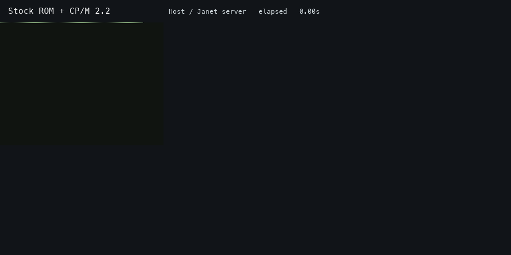
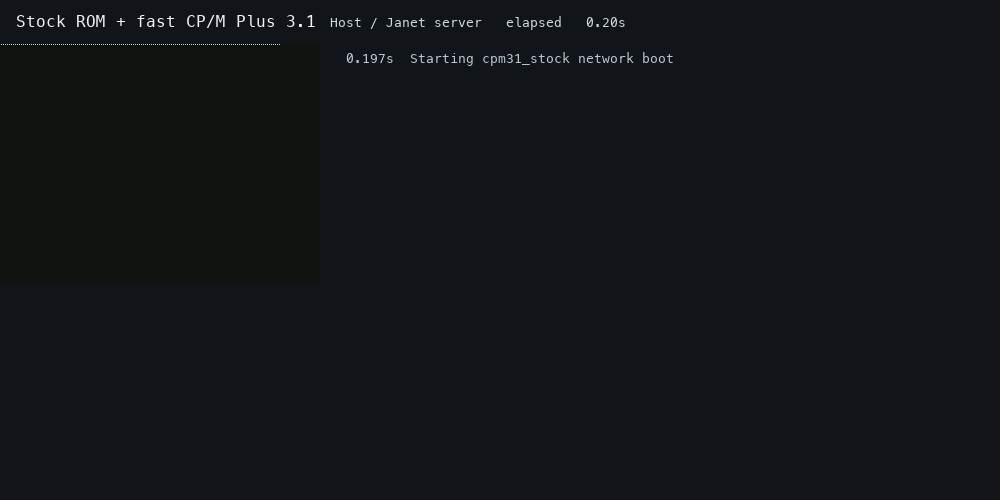
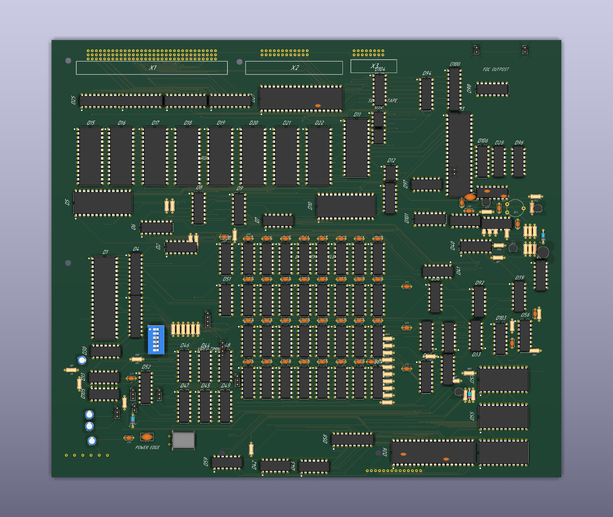
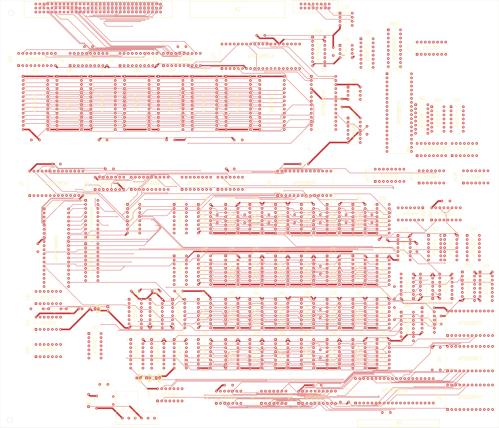
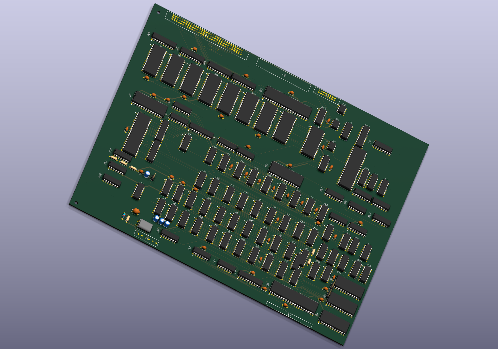
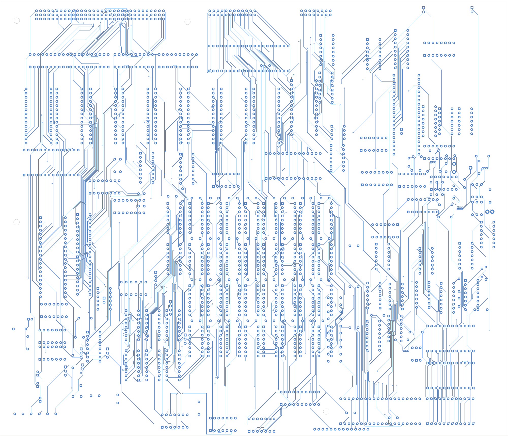

# 8080-cosim

Reconstruction of the Soviet/Estonian Juku E5104 processor board as both a
physical PCB and a runnable, headless digital model. The project’s distinctive
piece is an LVS-style check that compares the structural Verilog connectivity
with the machine-readable board model.

## Current result

- The C emulator and the structural `juku_top` model boot the real Juku ROM,
  render the same framebuffer, accept keyboard input, boot EKDOS from the
  vendored disk images, and reach disk BASIC `READY`. The deep value-level
  guard `sync/cosim_check.sh` compares `juku_top`'s typed CPU-bus events against
  the C emulator (`cosim`). The default trace covers memory and I/O reads and
  writes; a focused interrupt-acknowledge differential separately verifies the
  decoded `CD D4 FE` sequence. Instruction-level CPU and generated C/HDL FDC
  differentials cover their declared input spaces. The deep run reaches
  `BTRACE-END` without a type, address, or data divergence.
- The C emulator also has an opt-in D11/8251 PTY transport for diagnostic-ROM
  development. Its data/status mirrors, ready transitions, TX, and RX/echo are
  guarded by `tests/cosim_usart_pty_test.py` via `sync/juk_disk_check.sh`.
  The same transport now boots all five vendored CP/M/EKDOS system images,
  plus an optional external image such as the CP/Mish Juku build,
  through the stock interrupt-driven NetBios/Janet protocol. The parallel
  `sync/janet_netboot_check.sh` guard reaches each byte-exact `CA00h` handoff.
  The native `build/jukuhost` can then keep a diskless CP/Mish Juku attached to
  a host-backed A: volume and optionally expose an unchanged native 800 KiB
  Juku image as read-only B:. The archival stock bootstrap remains at nominal
  9,600 baud. BAUDTEST2 found that the original 19,200 mode-3 clock shape fails
  in the receive direction, then proved D57 mode 2/count 4 at 19,200/8O1;
  sustained network-disk traffic subsequently passed on physical CS00014 and
  CS00015. The Fastboot experiments let an unmodified stock ROM load one
  compact record at 9,600 before that proven setting sends a fixed
  CRC-protected ZX0 stream at 19,200. V1-V14 remain historical regression
  fixtures; the portable C host now admits the final V15 format as one narrowly
  bounded stock-ROM compatibility path. Repeated CS00015 work measured three
  clean v12 boots at
  5.739-5.740 seconds to the first disk request. V13 made both `A5 3A` and `JZ`
  handoffs overlap-safe and explicitly acknowledged; five of five physical
  boots succeeded, but four first streams still needed a CRC retry. The current
  v14 desk candidate removes that last timing dependency: it receives and
  authenticates the entire 4826-byte stream before ZX0 decode. Its clean,
  corruption/loss, partial-header, 3.4 MHz, prompt, and network `DIR` cosim
  matrix passes. A one-shot RxRDY IRQ delay reproduces a V13 retry but leaves
  V14 retry-free. Three physical CS00015 runs then completed at 6.069-6.115 s
  with zero retries, including two runs that needed a second extension-header
  probe. V14 is now the frozen production fastboot baseline; marginal timing
  gains alone do not justify another variant. The experimental V15 reuses that
  deterministic transport for CP/Mish's 51K all-RAM BIOS: the host validates a
  self-describing `JUKURM1` container, the simulator boots its 8,320-byte
  resident image at `B000h`, types `DIR` through the RAM matrix scanner, and
  verifies framebuffer output, 35 NetDisk-v2 reads, mode 3, and a fully masked
  PIC. The separately named RAM-BIOS/NetDisk-v3 payload adds CRC-protected
  three-record read-ahead with bounded raw/fill/deleted/prefix encodings. Its
  full stock-Janet-to-`DIR` path takes 12 disk exchanges instead of 35; cosim
  also proves one corrupted-response retry, negotiated v2/v1 fallback, and a
  complete host-loss recovery: three missing replies produce a bounded CP/M
  disk error, after which restored replies serve a fresh `TYPE README.TXT`
  without a target restart. Explicit N4 negotiation also provides a dual
  local/remote console:
  simulator runs type `VER` remotely and `DIR` locally with byte-identical
  transcripts, including automatic disable/backoff/reconnect after a lost
  console reply. N3 remains disk-only by default.
  The separately versioned EktaSoft `ekta4402` ROM adds `N fastboot`: its
  pinned 128-byte V15 core begins directly at 19,200/8N1, skipping Janet
  discovery and the complete 9,600-baud stock stage. A ROM-level simulator
  guard proves the checked extension handoff and execution; CP/Mish then
  reaches `A>` and completes NetDisk-v3 `DIR` with zero stock frames.
  The same direct V15 transport boots the separately maintained
  [`cpm-plus-juku`](https://github.com/ddanila/cpm-plus-juku) non-banked
  CP/M Plus 3.1 baseline at `7000h`: its standard SCB-linked RAM BIOS reaches
  `A>`, performs NetDisk-v3 `DIR`, and loads the shared `DIAG CPU` transient.
  CP/M Plus owns that system's sources, images, and regression; this repo owns
  the machine model, ROM, and host transport. A first CS00015 bench run exposed
  target-turnaround, queued-host-guard, and stale-PIC failures. Physical-time
  cosim now reproduces each through the real legacy code path; corrected direct
  and stock boots pass `A>`, `DIR`, and `DIAG CPU` with zero retries and zero
  modeled overruns. On physical CS00015, manually retaining the corrected
  19,200-baud disk server recovered the already-started system to `A>`, then
  passed `DIR` and the full `DIAG`; this qualifies the resident disk fix. The
  retired Python stock-`TN` wrapper could miss the delayed V15 core and fall
  back to 9,600. A CS00000 run proved the already-loaded core was alive by
  attaching directly at 19,200 without RESET. The C host now fixes that
  host-side defect: it validates only exact JF15 artifacts, learns any valid
  Janet identity, adapts its stock line-turn guard only when the client resumes
  polling, and probes the delayed core until the configured boot deadline.
  Ekta4402 was then fitted in
  CS00015: direct `N` boot reached CP/M Plus, NetDisk-v3 and N4; three
  automatic C4 boots reach disk service in 6.068--6.070 seconds, and live host
  replacement recovers `DIR` without RESET. A traced false failure proved that
  eager PTY input had been flushed by host raw-mode setup while Juku continued
  valid polls; readiness synchronization now prevents it. The inherited `J`
  API-v2 service passes PROBE, refresh query and READ with zero transport
  mismatch. On 2026-08-18 the exact ABI 1.2 C6 pair replaced Ekta4402 in
  CS00015 and passed repeated automatic 19,200-baud V16 boot, A:/B:, full
  diagnostics, local keyboard, ROM sound, writes, warm boot, soak, delayed-host
  recovery, and two live host replacements. The later ABI 1.3 C8 pair is now
  fitted and passed the same blind qualification plus native macOS service.
  The separately named ABI 1.4 C9 candidate adds bounded resident-host
  transactions and failure/negotiation telemetry, reserves S21 bit 0 for
  unconditional network boot, and passes the C-model, structural HDL, CP/M,
  native-host replacement, and `vc8080` N4 gates. Its CS00000 evaluation
  proved a PC7/POF blank-video defect. The separately named C10 candidate
  applies the stock-compatible POF release, adds full Port-C/visible-frame
  regressions and direct diagnostics, and has passed all desk, HDL, CP/M,
  native-host, and reproducible-package gates. Its D15/D16 pair is ready to
  program; local-video and full physical acceptance remain pending, with the
  known-good EKTA3.7 pair retained as rollback.
  A two-machine display control then isolated CS00015's remaining blank screen
  after CPU-visible framebuffer storage; the same corrected raw pattern is
  visible on CS00014. C6 remains immutable. Ekta4401, Ekta4402,
  and V14 remain frozen historical baselines. The original stock Janet path is
  unchanged as fallback.
- The sole production network host is portable C. Its native-Linux M2 build is
  physically qualified on CS00015, and the M2.2 desk port now builds the same
  core as a reproducible 16-bit Open Watcom DOS executable for Pocket8086.
  The actual EXE passes headless DOSBox-X at stock Janet 9,600 baud and C8
  Fastboot/NetDisk/N4 at 19,200 baud through emulated COM1. Images remain
  file-backed and the Pocket package runs with no options. Physical
  Pocket8086/CS00015 qualification is the remaining M2.3 gate before Win32.
- `sync/check.sh` reports no KiCad/HDL connectivity mismatch within its declared
  scope.
- The promoted routed main-board artifact exactly matches the live source.
  Stable KiCad reports no opens, electrical blockers, or dangling tracks or
  vias. Its Gerber/drill package is machine-verified,
  but remains under the functional design hold and must not be uploaded or
  ordered. Exact topology evidence is retained in
  `ref/routing/zero-open-promoted-topology.json`; the exact package snapshot is
  `ref/routing/zero-open-fabrication-package.json`, and fabrication/release
  gates are summarized in `docs/replica-manufacturing-readiness.md`.
  The separately preserved candidate is audit history, not the promoted board.
- The main board is **not released for fabrication**. Validated physical D2
  `.037`, D6 `.038`, D8 `.039`, and D94 `.092` tables are preserved from
  repeated reads across two `.009` boards; the measured D2/D30/D105 and
  D6/D13 continuity is adopted in the source model, HDL, and promoted route.
  D94 content truth and all five A0-A4 sources are owner-closed. D1-D3 reach
  D99/D93 with their measured pull-ups, while D4-D7 are owner/drawing-closed
  no-connects. The remaining D94 boundaries are the upstream source beyond the
  local pin15/D93.3 enable conductor and whether D0/pin1 has a hidden load
  beyond R8; the former BA11-BA15 input assignment was an unproved scaffold
  analogy and is retired. There are 3 official FDC-support ICs whose
  functional pin closure is still incomplete.
  Recovered sheet 3 closes D106 completely: its R78 preset pull-up, RAW READ
  load, D95 recovery clock, grounded clear, Q3 output, and five no-connects are
  now source-modeled and LVS-visible; R78 value/placement stays unresolved.
  Sheet 3 also closes D96's section-1 divide-by-two read-clock wiring. Primary
  device truth shows that WREQ asserts `/CLR1` and `/PRE1` together, producing
  Q1=/Q1=high and leaving restart phase undefined; `/Q` feedback still divides
  after release. A full-resolution reread restores D96 section 2 plus D28
  sections 5/6 and R93/R95 as the local DRQ/INTRQ path; D96.13 is drawn unused
  and the separately proved pin-8 test landing is retained. Primary SN74LS74A
  truth exposes the shared `/PRE2`/D2 wiring as set-only without a real pin13
  clear source. The copper is structural and LVS-visible, while D96.9/.11 and
  the functionally contradictory pin13 disposition remain verification gates.
  The source-closed D97/D102 delay cascade and D101 write-precompensation mux
  are also now structural and LVS-visible. Their recovered digital conductors
  are proved without assigning analog timing to the still-incomplete C16/C19
  markings or hiding D101.1/.3/.5/.6 behind simulation defaults.
  Source-closed D28 and D98 are likewise structural and LVS-visible, including
  all six D28 open-collector inverters, the five used D98 buffers, and the
  exact-revision omission of D98 buffer pair 4.
  The exact-revision sheet makes D97.13, D98.9/.10, and D102.4 intentional
  no-connects, leaving D96, D99, and D101 with open support-device functional pins.
  The measured D105 DBIN/H and MEMW paths are modeled in the source PCB and HDL;
  D6's validated physical table drives runnable memory selection directly and
  its chip-removed separate ROM/RAM outputs stay LVS-visible; the old functional
  decoder remains only as a non-LVS diagnostic comparison.
  A focused diagnostic now proves all eight physical modes leave D6.9 high at
  the `B37A` RAM-output failure, excluding mode selection and V1/V2 as causes
  across every raw A7..A5 row. Chip-removed continuity proves D6.12->D8.15
  and isolates D6.11 from D6.12, invalidating the earlier installed-PROM join.
  The report
  records the retired reader-order fault and the measurements that closed it;
  the promoted route carries the corrected topology with exact source parity.
  D30 READY sections A/B are modeled; owner continuity closes pin 8 to D29.7
  and pin 11 to the D105.2/D13.4/D11.20 clock conductor. Native sheet 1 plus
  the `.009` drawing and owner photo now close `H` as X1.107B/-BLOCK with its
  R1 2 kΩ pull-up. D7's physical SYNC/feedback strobe is
  preserved structurally while simulation uses a zero-delay-safe I/O activity oracle.
  In total, 43 modeled nets retain source-risk annotations requiring
  evidence or explicit redesign.
  See [PLAN.md](PLAN.md).

That last distinction matters: a clean DRC and a green LVS prove only the
connectivity represented in those checks. They do not prove omitted pins,
unmodeled footprints, reconstructed PROM contents, or analog/timing assumptions.

## Network boot demonstrations

These simulator captures pair the native Juku framebuffer on the left with
timestamped Janet host activity on the right. The simulator is paced at the
real 1.7 MHz CPU clock, the serial links use their stated baud rates, and GIF
delays preserve the measured scenario timeline.

### Stock ROM and CP/Mish CP/M 2.2

The archival 9,600-baud Janet bootstrap is intentionally shown at its original
speed.



### Historical stock-ROM CP/M Plus fast bootstrap

This frozen Python-era V15 capture records the unmodified-ROM experiment whose
compact loader switched to 19,200 baud. The exact JF15 protocol is now
supported by the C host for stock-ROM compatibility, but this historical GIF
itself is not regenerated by the current demo runner.



### Network ROM and CP/M Plus tools

The C8 network-first ROM boots CP/M Plus 3.1 through Fastboot V16 and
demonstrates the resident version report, text utilities, command history, and
control panel.


The capture inputs, dependencies, and regeneration commands are documented in
[`media/demos/README.md`](media/demos/README.md).

Downstream projects can consume the digest-pinned
`ghcr.io/ddanila/8080-cosim-smoke-kit` OCI image instead of cloning this whole
repository. The kit contains the Linux simulator, the static native
`jukuhost`, frozen non-runnable Python test fixtures, required ROMs, and a
machine-readable interface manifest at
`/opt/8080-cosim/smoke-kit.json`. It is republished only when those inputs or
its image definition change.

## Evidence and source hierarchy

1. Factory drawings, board photographs, dumps, and owner measurements under
   `ref/` are the historical evidence.
2. `kicad/juku.board.json` is the current machine-readable connectivity model.
3. `kicad/juku.kicad_sch`, the PCB files, and fabrication outputs are derived
   from or checked against that model.
4. `hdl/juku_top.v` is independently maintained structural Verilog and is
   checked against the modeled connectivity by `sync/`.
5. `cosim/` and the current upstream MAME Juku driver are behavioral oracles;
   they are not substitutes for missing physical wiring evidence.

## Board previews

These renders show the current routed engineering artifact, not a fabrication
release.

| 3D | 2D |
| --- | --- |
|  |  |
|  |  |

## Useful entry points

- [PLAN.md](PLAN.md) — remaining work and release criteria.
- [docs/README.md](docs/README.md) — documentation map and generated-report
  policy.
- [docs/development-workflow.md](docs/development-workflow.md) — canonical
  branch, intermediate commit, and direct-push policy.
- [docs/git-lfs-policy.md](docs/git-lfs-policy.md) — preservation and
  bandwidth policy for original reference photographs.
- [docs/architecture.md](docs/architecture.md) — model boundaries and data flow.
- [docs/source-coverage-audit.md](docs/source-coverage-audit.md) — adopted
  external evidence and remaining source gaps.
- [sync/README.md](sync/README.md) — verification commands.
- [docs/replica-manufacturing-readiness.md](docs/replica-manufacturing-readiness.md)
  — fabrication-package integrity and the current design hold.

## Quick checks

```sh
sync/check.sh
sync/boot_check.sh
sync/cosim_check.sh
python3 scripts/check_documentation_consistency.py
```

The long reset-to-EKDOS/BASIC and Monitor 3.3 diagnostics are intentionally
separate from the fast default checks; `sync/README.md` identifies their entry
points.

## Layout

| Path | Purpose |
| --- | --- |
| `ref/` | Factory drawings, photographs, firmware evidence, and external references |
| `kicad/` | Board model, generated schematic, source/routed PCB, zero-open audit candidate, and fabrication tooling |
| `hdl/` | Structural runnable model and device behavior |
| `cosim/` | Independent software emulator/oracle |
| `sync/` | LVS, behavioral comparisons, and subsystem guards |
| `roms/`, `media/` | Vendored preservation inputs with provenance/checksums |
| `docs/` | Current specifications and generated evidence reports |
| `spinoffs/jukupoly/` | Independent Juku CP/M three-tone-plus-percussion music engine, importers, songs, and evidence |
| `spinoffs/minimal-vga/` | Independent VJUGA experiment; not on the replica critical path |
