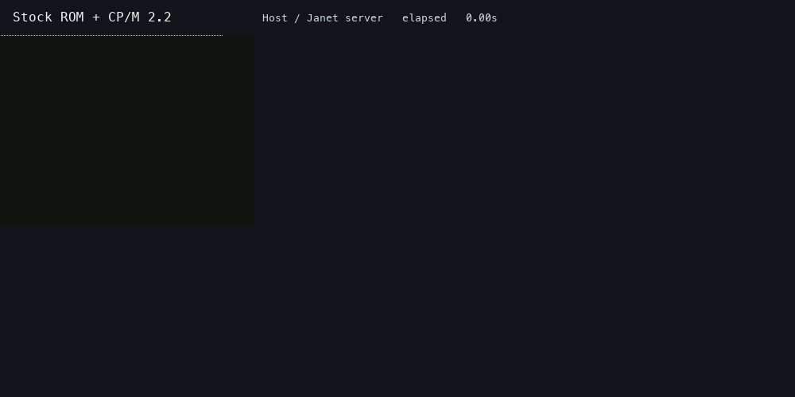
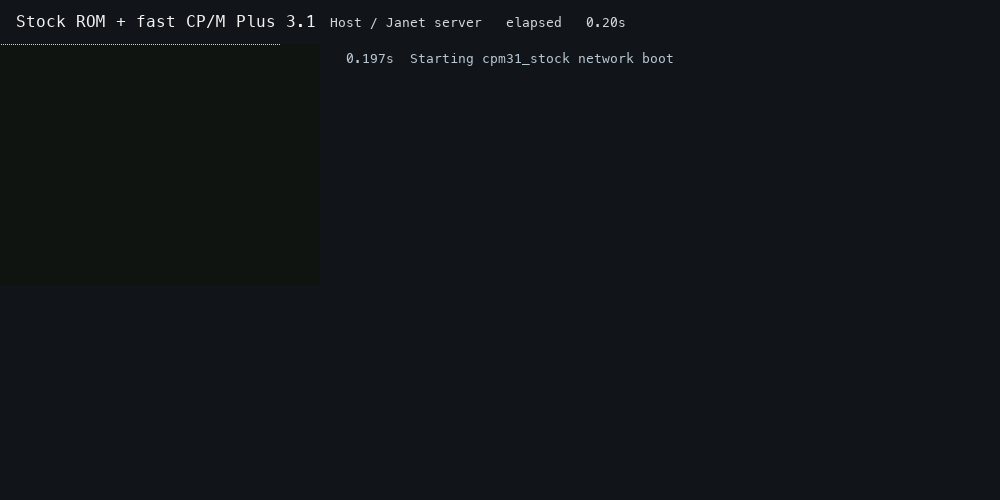
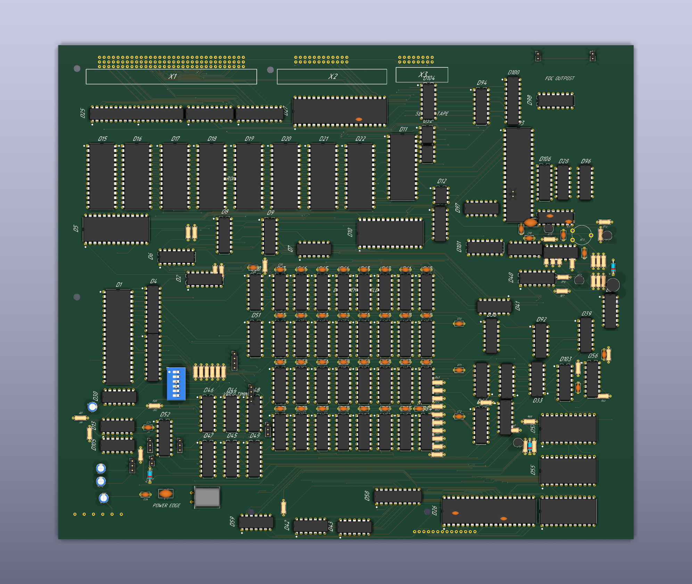
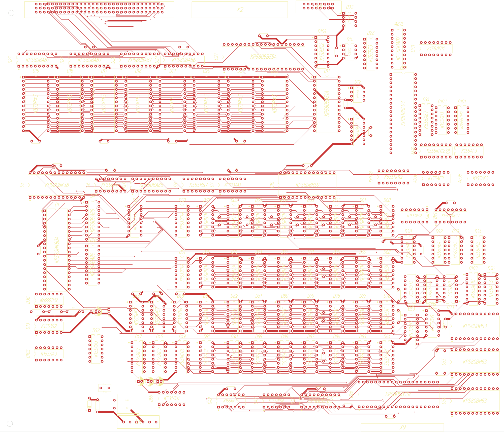
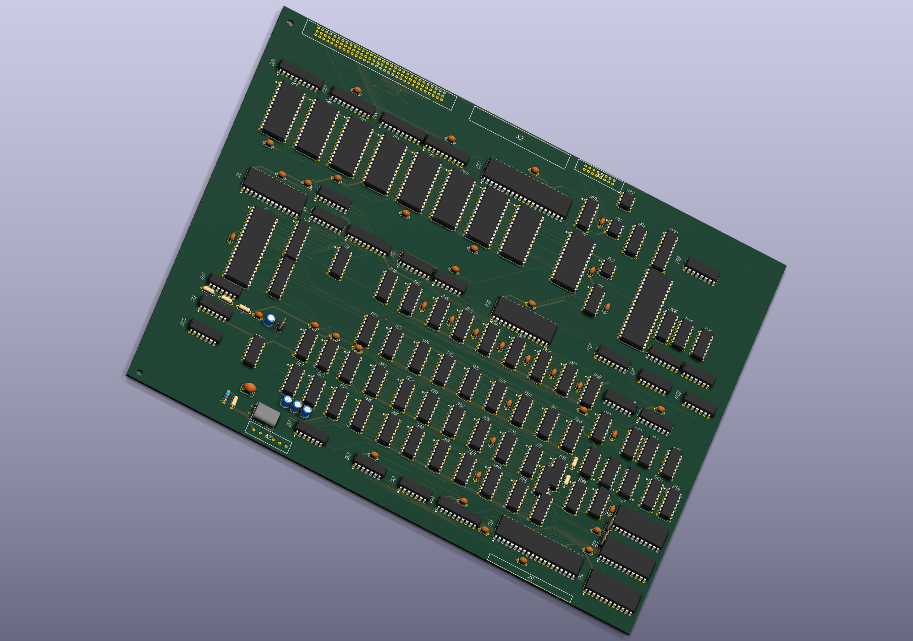
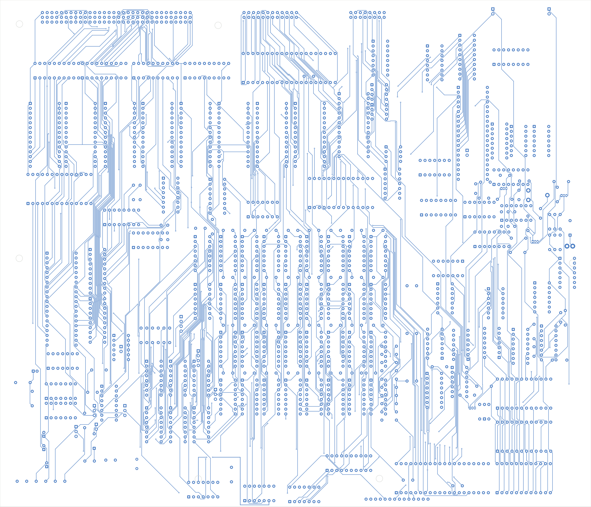

# 8080-cosim

Reconstruction of the Soviet/Estonian Juku E5104 processor board as a physical
PCB and a runnable digital model. Structural Verilog connectivity is checked
against the machine-readable board model with LVS.

## Current state

The C emulator and structural `juku_top` boot the real ROM, produce matching
framebuffers, accept keyboard input, boot the vendored EKDOS images and reach
disk BASIC `READY`. CPU, FDC, serial and subsystem guards cover their declared
inputs; the deep cosim guard compares typed CPU-bus events against the C oracle.

The production network host is portable C. Linux/macOS, DOS and the Windows
GUI share its core; Janet, Fastboot, NetDisk, N4, snapshots, journals and reset
recovery are implemented. See the [host contract](docs/portable-c-host-plan.md)
and [Windows guide](docs/windows-jukuhost-client.md) for platform qualification
and the latest build.

The physical board is on **DESIGN HOLD / PACKAGE REGENERATION REQUIRED**.
Hidden or conflicting source paths, physical placement, routed copper and
parts decisions remain. The evidence archive is a review package, and the
current Gerber/drill upload ZIP is absent. The
[manufacturing report](docs/replica-manufacturing-readiness.md) owns release
status; [PLAN.md](PLAN.md) lists the remaining work.

The physical shared-DRAM/video slot schedule is not complete. The runnable
framebuffer readout is an abstract oracle, not a proved VIDEO_OUT voltage
waveform. Green behavioral CI and LVS do not establish physical authenticity.

The independent spin-offs are [Jukuravi](spinoffs/jukuravi/README.md),
[VJUGA](spinoffs/minimal-vga/README.md) and
[JukuPoly](spinoffs/jukupoly/README.md). Their physical results and release
criteria are separate from the replica main board.

## Network boot demonstrations

These simulator captures pair the native Juku framebuffer on the left with
timestamped Janet host activity on the right. The simulator is paced at the
approximately 1.7 MHz effective CPU execution rate, the serial links use their
stated baud rates, and GIF
delays preserve the measured scenario timeline.

### Stock ROM and CP/Mish CP/M 2.2

The archival 9,600-baud Janet bootstrap is intentionally shown at its original
speed.



### Historical stock-ROM CP/M Plus fast bootstrap

This frozen Python-era V15 capture records the unmodified-ROM experiment whose
compact loader switched to 19,200 baud. The exact JF15 protocol is now
supported by the C host for stock-ROM compatibility, but this historical GIF
itself is not regenerated by the current demo runner.



### Network ROM and CP/M Plus tools

The C8 network-first ROM boots CP/M Plus 3.1 through Fastboot V16 and
demonstrates the resident version report, text utilities, command history, and
control panel.


The capture inputs, dependencies, and regeneration commands are documented in
[`media/demos/README.md`](media/demos/README.md).

Downstream projects can consume the digest-pinned
`ghcr.io/ddanila/8080-cosim-smoke-kit` OCI image instead of cloning this whole
repository. This Linux amd64 artifact image contains the simulator, static
`jukuhost`, frozen non-runnable Python test fixtures, and the three ROMs listed
in [its manifest](.github/smoke-kit/smoke-kit.json), installed at
`/opt/8080-cosim/smoke-kit.json`. Its `scratch` image supplies no shell or
simulator shared libraries; copy the artifacts into a compatible runtime as
defined by [the Dockerfile](.github/smoke-kit/Dockerfile). Selected input changes
on `master` and manual dispatch publish `v2` and a source-SHA tag. Pin a digest
for a fixed artifact; `v2` is a moving tag.

## Evidence and source hierarchy

1. Factory drawings, board photographs, dumps, and owner measurements under
   `ref/` are the historical evidence.
2. `kicad/juku.board.json` is the current machine-readable connectivity model.
3. `kicad/juku.kicad_sch`, the PCB files, and fabrication outputs are derived
   from or checked against that model.
4. `hdl/juku_top.v` is independently maintained structural Verilog and is
   checked against the modeled connectivity by `sync/`.
5. `cosim/` and the vendored MAME Juku driver (`ref/mame_juku.cpp`) are behavioral references;
   they are not substitutes for missing physical wiring evidence.

## Board previews

These saved renders show a routed engineering snapshot and may lag the current
PCB. Refresh them with `kicad/render_views.sh` after reviewing board changes;
the [renderer](kicad/render_views.sh) documents its KiCad, font and rasterizer
requirements. Use the PCB and release reports to assess the current design.

| 3D | 2D |
| --- | --- |
|  |  |
|  |  |

## Useful entry points

- [PLAN.md](PLAN.md) — remaining work and release criteria.
- [docs/README.md](docs/README.md) — documentation map and generated-report
  policy.
- [docs/development-workflow.md](docs/development-workflow.md) — canonical
  branch, intermediate commit, and direct-push policy.
- [docs/git-lfs-policy.md](docs/git-lfs-policy.md) — preservation and
  bandwidth policy for original reference photographs.
- [docs/architecture.md](docs/architecture.md) — model boundaries and data flow.
- [docs/source-coverage-audit.md](docs/source-coverage-audit.md) — adopted
  external evidence and remaining source gaps.
- [sync/README.md](sync/README.md) — verification commands.
- [docs/replica-manufacturing-readiness.md](docs/replica-manufacturing-readiness.md)
  — fabrication-package integrity and the current design hold.

## Verification commands

```sh
sync/check.sh
sync/boot_check.sh
sync/cosim_check.sh
python3 scripts/check_documentation_consistency.py
```

`sync/cosim_check.sh` is a deep guard and can take substantially longer than
the other commands. The long reset-to-EKDOS/BASIC and Monitor 3.3 diagnostics
have separate entry points listed in `sync/README.md`.

## Layout

| Path | Purpose |
| --- | --- |
| `ref/` | Factory drawings, photographs, firmware evidence, and external references |
| `kicad/` | Board model, generated schematic, source/routed PCBs with current routing holds, and fabrication tooling |
| `hdl/` | Structural runnable model and device behavior |
| `cosim/` | Independent software emulator/oracle |
| `sync/` | LVS, behavioral comparisons, and subsystem guards |
| `roms/`, `media/` | Vendored preservation inputs with provenance/checksums |
| `docs/` | Current specifications and generated evidence reports |
| `spinoffs/jukupoly/` | Independent Juku CP/M three-tone-plus-percussion music engine, importers, songs, and evidence |
| `spinoffs/minimal-vga/` | Independent VJUGA experiment; not on the replica critical path |
